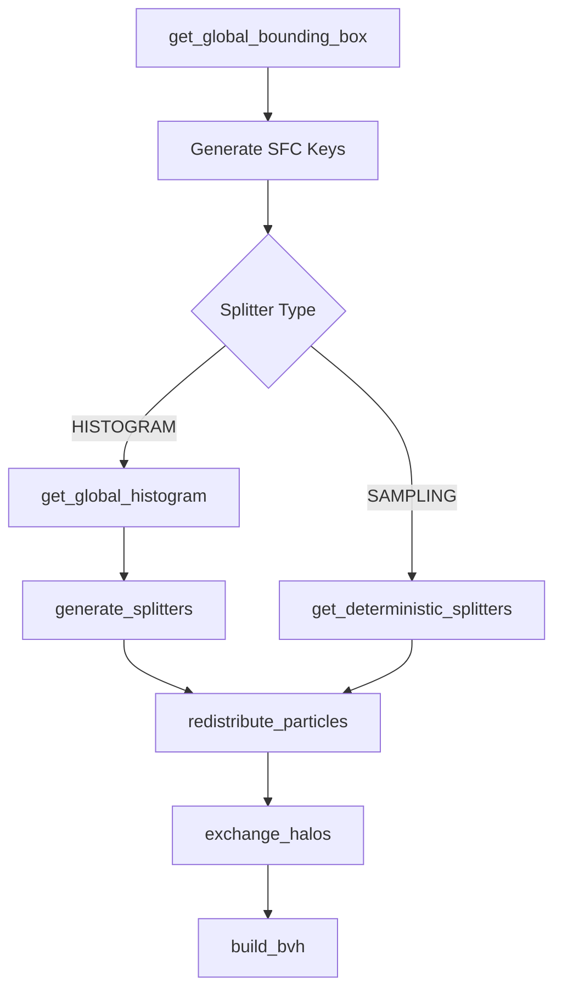

# SYCL-HLBVH & Distributed Domain Decomposition API Reference

This document provides a comprehensive reference for the data structures, helper functions, algorithms, and compile-time configurations of the SYCL-HLBVH cosmomological tree builder (`src/hlbvh.hpp`) and the Distributed Domain Decomposition framework (`src/domain_decomposition.hpp`).

The project is implemented as a header-only, C++23/SYCL library designed for extreme performance on homogeneous CPU nodes and GPU accelerators (NVIDIA/AMD), supporting MPI-based distributed simulations.

---

## 1. Compile-Time CMake Configurations

The behavior, space-filling curve encoding, precision, and hardware acceleration of the project are controlled by compile-time CMake flags. These flags define preprocessor macros used by the compiler.

| CMake Cache Variable | Preprocessor Macro | Supported Values | Default | Description |
| :--- | :--- | :--- | :--- | :--- |
| `SFC_TYPE` | `SFC_TYPE_MORTON` <br> `SFC_TYPE_PEANO_HILBERT` | `MORTON`, `PEANO_HILBERT` | `MORTON` | Configures the underlying Space-Filling Curve (SFC) for spatial indexing and tree construction. |
| `COORDS_REPRESENTATION` | `FASTTREE_INTEGER_COORDS` | `FLOAT`, `INTEGER` | `FLOAT` | Chooses between floating-point and integer coordinate representations. |
| `COORDS_TYPE` | `COORDS_TYPE_FLOAT` <br> `COORDS_TYPE_DOUBLE` | `FLOAT`, `DOUBLE` | `FLOAT` | Sets the floating-point precision type `coord_t` (`float` or `double`) when floating-point coordinates are used. |
| `POSITIONS_PRECISION` | `POSITIONS_IN_32BIT` <br> `POSITIONS_IN_64BIT` <br> `POSITIONS_IN_128BIT` | `32`, `64`, `128` | `32` | Sets integer position word precision (32-bit, 64-bit, or 128-bit) when `COORDS_REPRESENTATION` is `INTEGER`. |
| `RETURN_ORIG_INDICES` | `RETURN_ORIG_INDICES` | `True`, `False` | `False` | When `True`, tree queries return original input particle IDs instead of sorted leaf position indices. |
| `DCOMPOSITION_TYPE` | `DCOMPOSITION_TYPE_HISTOGRAM` <br> `DCOMPOSITION_TYPE_SAMPLING` | `HISTOGRAM`, `SAMPLING` | `HISTOGRAM` | Selects between histogram-based splitters and stride-based sampling for domain decomposition. |
| `TARGET_GPU` | (Compiler Flags) | `nvidia`, `amd`, or empty (CPU) | (empty) | Adds target-specific SYCL compilation flags (e.g. for NVIDIA `nvptx64` with CUDA). |

---

## 2. Core Data Structures

### `particles<T>`
An SoA (Structure of Arrays) representation of particles.

```cpp
template <typename T>
struct particles {
  std::vector<T> pos_x, pos_y, pos_z;
  std::vector<T> mass;
  std::vector<uint32_t> id;
  std::vector<int8_t> is_ghost;
};
```
* **Architectural Rationale:** Using a Structure of Arrays (SoA) guarantees that threads within a GPU warp perform coalesced memory reads when accessing coordinates or properties, maximizing global memory bandwidth.
* **Fields:**
  * `pos_x`, `pos_y`, `pos_z`: Coordinates of the particles (typed to `T`).
  * `mass`: Mass attributes (retained for physics calculations, to be deprecated in future).
  * `id`: Unique 32-bit particle identifiers. Used to track identity during MPI domain shuffling and local tree sorting.
  * `is_ghost`: Flat array of 8-bit integers tagging particle status. A value of `0` denotes a locally owned particle; `1` denotes a ghost particle received from a neighboring domain during halo exchange.

### `BoundingBox<FloatT>`
An axis-aligned bounding box bounding a spatial domain.

```cpp
template <typename FloatT>
struct BoundingBox {
  FloatT min_x, max_x;
  FloatT min_y, max_y;
  FloatT min_z, max_z;
  
  BoundingBox(FloatT min_x_, FloatT max_x_, FloatT min_y_, FloatT max_y_, FloatT min_z_, FloatT max_z_);
};
```
* **Constraint:** Supports only `float` or `double` (enforced via static assertion).

### `TreeSoA`
The pointer-free spatial tree representation of the HLBVH.

```cpp
struct TreeSoA {
  coord_t *min_x, *max_x;
  coord_t *min_y, *max_y;
  coord_t *min_z, *max_z;
  int *left_child;
  int *right_child;
  int *parent;
  uint32_t *id;
  int8_t *is_ghost;
  size_t num_leaves;
  size_t num_internal;
  
  TreeSoA(sycl::queue &q, size_t n);
  void free(sycl::queue &q);
};
```
* **Strictly Pointer-Free Layout:** Parent-child relationships and node bounds are tracked via contiguous arrays and integer indices. The tree contains no raw pointers or dynamic containers, allowing it to be copied as a raw block of bytes and transmitted over MPI.
* **Flattened Array Indexing:**
  * **Root Node:** Always stored at index `0`.
  * **Internal Nodes:** Stored at indices `[0, num_internal - 1]`. There are exactly $N - 1$ internal nodes (where $N$ is the number of leaves).
  * **Leaf Nodes:** Stored at indices `[num_internal, num_leaves + num_internal - 1]` (equivalent to `[N - 1, 2N - 2]`). A leaf node represents a single physical particle, and its bounding box is degenerate (`min_x == max_x`, etc.).
  * **Traversal indexing:** A child pointer value $C$ pointing to a child is processed as: if $C \ge N - 1$ (or `num_leaves - 1`), it is a leaf representing particle index $C - (N - 1)$. Otherwise, it is an internal node at index $C$.

---

## 3. Unified USM Pointer Verification Helpers

To prevent GPU driver page faults and hangs on systems without Heterogeneous Memory Management (HMM), host pointers (e.g. from `std::vector::data()`) must not be dereferenced in GPU kernels. The following helper templates dynamically inspect and redirect memory:

* **`ensure_device_readable<T>(q, ptr, count, allocated)`**
  Queries the pointer type. If it is host-allocated (`sycl::usm::alloc::unknown`), it allocates USM device memory, copies `count` elements, sets `allocated = true`, and returns the device pointer. Otherwise, returns `ptr`.
* **`ensure_device_writable<T>(q, ptr, count, allocated)`**
  Allocates temporary USM device memory if `ptr` is host-allocated, setting `allocated = true`.
* **`copy_back_and_free<T>(q, dev_ptr, host_ptr, count, allocated)`**
  Copies results from the temporary device pointer back to the host and frees the USM memory.
* **`free_device_readable<T>(q, dev_ptr, allocated)`**
  Frees temporary device memory if it was allocated.

---

## 4. Space-Filling Curves (SFC) & Coordinate Representation

The spatial coordinates can be represented either directly as floating-point numbers (`float`/`double`) or as discrete integer position representations (`uint32_t`, `uint64_t`, or `uint128_t`). Coordinates are mapped onto a 1D SFC index representing a 3D grid layout (`BITS_PER_DIMENSION = 21` for 32-bit positions, up to `BITS_PER_DIMENSION = 42` for 64-bit/128-bit positions).

### `float_to_int_rep`
```cpp
template <typename FloatT = double>
inline MyIntPosType float_to_int_rep(FloatT normalized) noexcept;

template <typename FloatT>
inline MyIntPosType float_to_int_rep(FloatT val, FloatT min_val, FloatT inv_dx) noexcept;
```
* **Description:** Converts a physical or normalized floating-point coordinate into its corresponding integer coordinate representation `MyIntPosType`.
* **Methodology:** Normalizes `val` to $[0.0, 1.0)$, shifts to $[1.0, 2.0)$, extracts mantissa bits via `sycl::bit_cast<uint64_t>`, and stores quantized integer bits.

### `int_rep_to_float`
```cpp
inline double int_rep_to_float(MyIntPosType int_val) noexcept;

template <typename FloatT>
inline double int_rep_to_float(MyIntPosType int_val, FloatT min_val, FloatT dx) noexcept;
```
* **Description:** Converts an integer coordinate representation `MyIntPosType` back to a normalized `double` in $[0.0, 1.0)$ or a physical coordinate.
* **Precision Note:** When `BITS_PER_DIMENSION > 52` with 64-bit integer coordinates, double precision conversion is lossy due to IEEE 754 52-bit mantissa precision limits.

### `encode_to_sfc1d`
```cpp
template <typename FloatT>
inline sfc1D encode_to_sfc1d(FloatT val) noexcept;
```
* **Methodology:** For normalized coordinate `val` in $[1.0, 2.0)$, it reinterprets bits using `sycl::bit_cast` and shifts them to extract the top quantized bits of the mantissa field.

### `sfc_encode`
```cpp
template <typename FloatT>
inline void sfc_encode(sycl::queue &q, const FloatT *pos_x, const FloatT *pos_y, const FloatT *pos_z, 
                       size_t num_particles, sfc_key *keys, const BoundingBox<FloatT> &bbox);
```
* **Algorithm:**
  Normalizes coordinates into $[0.0, 1.0)$ relative to the bounding box, maps them to $[1.0, 2.0)$, and calls `encode_to_sfc1d` to obtain integer coordinates `(ix, iy, iz)`.
  * **Morton Encoding (`SFC_TYPE_MORTON`):** Spreads bits of `ix`, `iy`, and `iz` with 2-bit gaps using lookup masks (`spread3_u64`) and interleaves them.
  * **Peano-Hilbert Encoding (`SFC_TYPE_PEANO_HILBERT`):** Invokes `sfc_encode3D` which iteratively rotates and reflects coordinate octants to preserve optimal spatial locality.

---

## 5. Tree Construction Algorithms

### `compute_bbox`
```cpp
template <typename FloatT>
inline BoundingBox<FloatT> compute_bbox(sycl::queue &q, const FloatT *pos_x, const FloatT *pos_y, const FloatT *pos_z, size_t n);
```
* **Algorithm:** Executes parallel reductions on the GPU using `sycl::reduction` to determine the minimum and maximum coordinates.
* **Memory Safety:** Allocates USM shared memory variables initialized to identity values (`max()` for minimums, `-max()` for maximums) on the host before kernel execution to prevent reduction bias.

### `build_tree`
```cpp
inline void build_tree(sycl::queue &q, TreeSoA &tree, const sfc_key *sorted_keys, const coord_t *sorted_x, const coord_t *sorted_y,
                       const coord_t *sorted_z, const uint32_t *sorted_id, const int8_t *sorted_is_ghost);
```
* **Algorithm (Karras 2012 Radix Tree):**
  1. For each internal node $i \in [0, N - 2]$, it inspects the common prefixes of keys using the prefix length function $\delta(i, j) = \text{CLZ}(key_i \oplus key_j)$ with tie-breakers.
  2. Determines the range direction $d = \text{sgn}(\delta(i, i+1) - \delta(i, i-1))$.
  3. Computes the upper bound of the node's range $l_{max}$ by doubling strides.
  4. Runs a binary search to locate the exact other end of the range $j$.
  5. Finds the split point $split$ dividing the range $[i, j]$ such that the prefix length increases.
  6. Assigns child indices: the left child is $split$ (if internal) or $split + N - 1$ (if leaf); the right child is $split + 1$ or $split + 1 + N - 1$.
* **Bottom-Up Bounding Boxes:**
  Launches $N$ parallel threads starting from the leaf nodes. Each thread traverses upwards towards the root using parent pointers. It performs an atomic fetch-add on a per-node synchronization counter. The first child to arrive at an internal node terminates. The second child computes the enclosing bounding box from both child nodes and continues the upward traversal. Memory operations utilize system-wide cache-coherent atomic ordering (`sycl::memory_order::seq_cst`).

### `build_bvh`
```cpp
inline void build_bvh(sycl::queue &q, const particles<coord_t> &p, TreeSoA &tree);
```
* **Workflow:** High-level coordinator that computes the bounding box, encodes SFC keys, sorts keys and particle indices in a single GPU pass via `oneapi::dpl::sort` on zipped iterators, reorders the particle properties SoA on the GPU, and calls `build_tree`.

---

## 6. Query APIs

### `PriorityQueue<T, MAX_K>`
A statically sized priority queue structure designed for device memory.
* **Design:** Because dynamic memory allocations are not supported in device kernels, `PriorityQueue` stores results in a fixed-size array on the thread's registers/local stack.
* **Sorting:** Uses insertion sort upon pushing a new element. If the queue is full, the incoming element replaces the head (which contains the largest distance value) if it is closer.

### `knn_query`
```cpp
inline void knn_query(sycl::queue &q, const TreeSoA &tree, const coord_t *qx, const coord_t *qy, const coord_t *qz, int k, int num_queries,
                      int *results, coord_t *result_dists);
```
* **Algorithm:** Launches a thread per query. Traverse the tree using a local stack array. Prunes branches if the queue is full and the squared distance to the node's bounding box is greater than the queue's current maximum distance.
* **Heuristics:** Visited children are prioritized: the distance to both children's bounding boxes is calculated, and the closer child is pushed onto the stack last (so it is popped and evaluated first).

### `range_query`
```cpp
inline void range_query(sycl::queue &q, const TreeSoA &tree, const coord_t *qx, const coord_t *qy, const coord_t *qz, const coord_t *r_min,
                        const coord_t *r_max, int num_queries, int *results, int *result_counts, int max_results_per_query);
```
* **Algorithm:** Traverses the tree non-recursively. For each node, it calculates the minimum squared distance to the bounding box. If it is within the maximum radius, traversal continues. Leaf nodes are evaluated against both minimum and maximum radii to determine inclusion.

---

## 7. Distributed Domain Decomposition

Distributed domain decomposition balances particle loads across MPI ranks while ensuring spatial locality.



### `get_global_bounding_box`
```cpp
template <typename FloatT>
inline BoundingBox<FloatT> get_global_bounding_box(sycl::queue &q, const particles<FloatT> &p);
```
* **MPI Collective:** Runs `MPI_Allreduce` with `MPI_MIN` and `MPI_MAX` on local bounding boxes to align coordinates across all ranks.

### `get_global_histogram`
```cpp
template <typename FloatT>
inline std::vector<int> get_global_histogram(sycl::queue &q, const particles<FloatT> &p, const BoundingBox<FloatT> &global_bbox, int m);
```
* **MPI Collective:** Runs `MPI_Allreduce` with `MPI_SUM` on local bucket histograms. It partitions the space using the top $m$ bits of the 64-bit key (usually $m=20$, creating $1.04$ million virtual voxels).

### `generate_splitters`
```cpp
inline std::vector<uint32_t> generate_splitters(const std::vector<int> &global_hist, int P, int m);
```
* **Algorithm:** Scans the global histogram to find bucket boundaries dividing the global particles into $P$ segments of size $N_{total}/P$. Ranks compute this locally to avoid communication.

### `get_deterministic_splitters`
```cpp
template <typename FloatT>
inline std::vector<sfc_key> get_deterministic_splitters(sycl::queue &q, const particles<FloatT> &p, const BoundingBox<FloatT> &global_bbox);
```
* **Algorithm:** Stride-based sampling. Each rank sorts its local keys, records $128$ keys at regular strides, and gathers them to Rank 0 using `MPI_Gather`. Rank 0 sorts the aggregated samples and extracts partition splitters, broadcasting them to all ranks via `MPI_Bcast`.

### `redistribute_particles`
```cpp
template <typename FloatT>
inline particles<FloatT> redistribute_particles(sycl::queue &q, particles<FloatT> &p,
#if defined(DCOMPOSITION_TYPE_SAMPLING)
                                                const std::vector<sfc_key> &rank_splitters,
#else
                                                const std::vector<uint32_t> &rank_splitters,
#endif
                                                const BoundingBox<FloatT> &global_bbox, int m);
```
* **Pipeline:**
  1. Encodes local particles and runs a GPU binary search on splitters to determine each particle's destination rank.
  2. Sorts particle indices by target rank on the GPU using `oneapi::dpl::sort` to create contiguous send segments.
  3. Packs coordinates, masses, IDs, and ghost flags into contiguous USM buffers.
  4. Exchanges count histograms using `MPI_Alltoall` to determine incoming receive sizes.
  5. Dynamically allocates receive buffers and executes `MPI_Alltoallv` to shuffle particles over the network.

### `exchange_halos`
```cpp
template <typename FloatT>
inline particles<FloatT> exchange_halos(sycl::queue &q, particles<FloatT> &p, FloatT h_max);
```
* **Static Ghosting Exchange:**
  1. Shares local bounding boxes of redistributed particles globally via `MPI_Allgather`.
  2. Identifies neighboring domains that overlap this rank's boundaries expanded by search radius $h_{max}$.
  3. **Two-Pass GPU Filter:** Pass 1 counts how many local particles lie within the boundary of each overlapping neighbor. Pass 2 allocates a matched indices array of the exact size and writes the indices, preventing out-of-memory allocations.
  4. Packs boundary particles into send buffers, setting their remote `is_ghost` flag to `1`.
  5. Exchanges counts using `MPI_Alltoall` and routes boundary data using `MPI_Alltoallv`.
  6. Appends the received ghost particles to the local particle vectors, returning a single combined SoA.