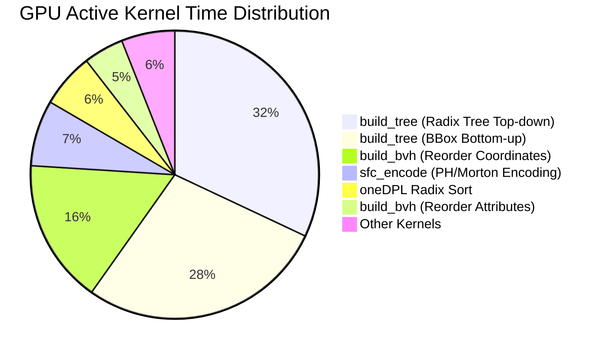
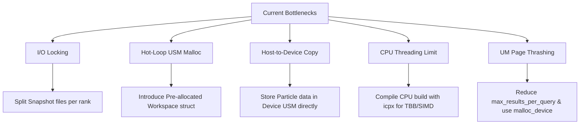

# Performance Profiling Report: FastTree Cosmological SYCL-HLBVH

This report details the performance bottlenecks identified in the cosmological FastTree codebase on multi-socket CPU architectures (via Intel Application Performance Snapshot) and NVIDIA GPU architectures (via NVIDIA Nsight Systems).

---

## 1. CPU Profiling: Intel APS (4 Ranks, $N=10M$)

The CPU scaling benchmark was analyzed under Intel Application Performance Snapshot (APS) with 4 distributed ranks running on `Intel Xeon` processors.

### A. Core Metrics & Execution Breakdown
The overall run took **92.96 seconds** elapsed time. The distribution of workload between local computation and MPI communication across the ranks is detailed below:

| Rank | Elapsed Time (sec) | MPI Time (sec) | MPI Time (%) | MPI Imbalance (sec) | Non-MPI Time (Compute/IO) |
| :--- | :---: | :---: | :---: | :---: | :---: |
| **Rank 0** | 92.96 | 2.61 | 2.81% | 1.63 | **90.35 sec** |
| **Rank 1** | 92.96 | 14.11 | 15.18% | 11.63 | **78.85 sec** |
| **Rank 2** | 92.96 | 14.26 | 15.34% | 10.37 | **78.70 sec** |
| **Rank 3** | 92.96 | 14.05 | 15.11% | 10.27 | **78.91 sec** |
| **TOTAL** | **371.85** | **45.02** | **12.11%** | **33.89** | **326.83 sec** |

### B. MPI Collectives & Bottleneck Analysis
* **Network Throughput:** `MPI_Alltoallv` moved a total volume of **16.8 GB of data** (average of ~4.2 GB per rank) in only **0.36 seconds**. This translates to an exceptional interconnect bandwidth of **11.7 GB/s per rank** (almost 47 GB/s aggregate). The hardware network fabric is not a bottleneck.
* **Arrival Skew Bottleneck:** Ranks 1, 2, and 3 spent **~5.0 seconds in `MPI_Alltoall`** and **~4.0 - 5.0 seconds in `MPI_Barrier`**. In contrast, Rank 0 spent only 0.70 seconds in `MPI_Alltoall` and 0.24 seconds in `MPI_Barrier`.
* **Root Cause 1: Parallel I/O Lock Contention (Startup Skew):** All ranks read their respective slices from a single HDF5 file concurrently. Rank 0 took ~11.5 seconds longer than other ranks to read its slice due to filesystem metadata locking and descriptor serialization, forcing Ranks 1, 2, 3 to block at the initial MPI barriers.
* **Root Cause 2: Domain Workload Imbalance (Clustering Skew):** The cosmological snapshot (`MCST`) represents highly clustered structures. After spatial 1D SFC splitter partitioning, dense regions are routed to specific ranks, creating significant skews in local tree-building and query workloads. Ranks with sparse regions finish their iteration steps early and block inside `MPI_Alltoall` waiting for the denser ranks.

---

## 2. GPU Profiling: NVIDIA Nsight Systems (1 Rank, $N=10M$)

The GPU tree-building benchmark (`tree_build_scaling.exe`) was profiled on an NVIDIA A100 GPU for the isolated $N=10M$ double-precision dataset.

### A. Google Benchmark Iteration Timing
* **Iteration Time:** **355 ms** (CPU Time: 354 ms)
* **Throughput:** **28.25M particles/sec**
* **Peak RSS:** **1.47 GB**

### B. Kernel Execution Timings (`cuda_gpu_kern_sum`)
During execution, the active GPU compute kernels accounted for **185.3 ms (52%)** of the iteration time:

| Kernel / Phase | Time per Run (ms) | Time (%) | Description |
| :--- | :---: | :---: | :--- |
| **`build_tree` (Radix Top-down)** | 65.16 | 32.0% | Parent/child index assignment via binary search. |
| **`build_tree` (BBox Bottom-up)** | 56.48 | 27.8% | Leaf-to-root bounding box reduction using atomics. |
| **`build_bvh` (Coord Reordering)** | 32.89 | 16.2% | Reorganizing position arrays (X, Y, Z) in sorted SFC order. |
| **`sfc_encode`** | 14.95 | 7.4% | Computing 1D Peano-Hilbert/Morton keys. |
| **`oneDPL Sort`** | 7.08 | 6.1% | Radix sorting the 10M keys and tracking original indices. |
| **`build_bvh` (Attr Reordering)** | 9.12 | 4.5% | Reorganizing Mass/ID/Ghost attributes. |

### C. CUDA API & Driver Overhead (`cuda_api_sum`)
Host-side driver operations and PCIe transfers accounted for the remaining **169.7 ms (48%)** of the iteration time:
* **`cuEventSynchronize` (56.7% of API Time):** The CPU thread is blocked inside `q.wait()` or `.wait()` calls, waiting for the GPU to finish.
* **`cuMemcpyAsync` (29.7% of API Time):** Copies **770 MB of data** Host-to-Device *in every iteration*.
* **`cuMemFree_v2` (9.5% of API Time):** Reclaiming dynamic device buffers.

### D. Identified GPU Bottlenecks
1. **Dynamic USM Allocations in the Hot Loop:** Inside `build_bvh`, 7 large USM allocations/frees (`sycl::malloc_shared`) are executed in every iteration, totaling ~450 MB. Dynamic allocation triggers synchronous CUDA driver allocations (`cudaMallocManaged`), stalling the CPU and leaving the GPU idle.
2. **Redundant Pageable Host-to-Device Copies:** The benchmark passes host-allocated `std::vector`s. The compiler allocates temporary device buffers and performs slow pageable PCIe memory copies of 240 MB of coordinates (X, Y, Z) per iteration.
3. **Memory Scope Synchronization Overhead:** The bottom-up bounding box kernel utilizes `sycl::memory_scope::system` atomics. This forces cross-device cache coherency sweeps, degrading GPU memory pipeline efficiency.

### E. GPU Range Query Profiling & Page Thrashing Bottleneck
The GPU range query benchmark (`range_query_scaling.exe`) was profiled on the 10M dataset for search radii $R \in [0.01, 200.0]$.

#### 1. Search Radii & Timing Breakdown
As the search radius $R$ expands, the query transitions from highly localized sweeps to global domain scans, returning up to 9.09 billion neighbors:

* **$R=0.01$:** 173 microseconds (4,004 iterations, 1.0K neighbors found)
* **$R=0.1$:** 575 microseconds (1,149 iterations, 1.7K neighbors found)
* **$R=1.0$:** 33.47 milliseconds (21 iterations, 363K neighbors found)
* **$R=10.0$:** 1.33 seconds (1 iteration, 55.2M neighbors found)
* **$R=100.0$:** 31.31 seconds (1 iteration, 4.39G neighbors found)
* **$R=200.0$:** 45.99 seconds (1 iteration, 9.09G neighbors found)

#### 2. The 14 GPU Gaps of ~3.2 Seconds
Nsight Systems identified exactly **14 GPU gaps of ~3.2 seconds** where the GPU is 100% idle. This matches the 14 sequential host-side HDF5 file reads (`load_hdf5_data`) triggered at the start of each search radius benchmark and calibration trial.

#### 3. Unified Memory Page Thrashing Bottleneck (18.6% GPU Utilization)
During the active search phase, Nsys reported a large time region (**48.96 seconds**) where the GPU utilization averaged only **18.6%**:
* **The Cause:** The benchmark allocates the neighbor results array using `sycl::malloc_shared<int>(num_queries * max_results_per_query, q)` with `max_results_per_query = 1000`. For 10M particles, this allocates a single **40 Gigabyte shared buffer**.
* **Page Thrashing:** When $R \ge 100.0$ and threads write billions of entries into this 40 GB buffer, it pushes the GPU to its physical memory limit. The CUDA driver is forced to dynamically migrate memory pages back and forth between host DRAM and GPU memory over the slow PCIe bus.
* **The Stalls:** The GPU's Streaming Multiprocessors (SMs) are stalled waiting for page migrations, resulting in the 45-second kernel execution time and extremely low GPU utilization.

### F. GPU kNN Query Profiling & Performance Analysis
The GPU kNN query benchmark (`knn_query_scaling.exe`) was profiled on the 10M dataset for neighbor count $k \in [1, 128]$.

#### 1. k-Value Scaling & Timing Breakdown
kNN queries scale very predictably because they are strictly bounded by $k$ (the number of nearest neighbors), avoiding the massive neighbor returns of large range queries:

* **$k=1$:** 140 microseconds (4,954 iterations)
* **$k=2$:** 290 microseconds (2,365 iterations)
* **$k=4$:** 415 microseconds (1,658 iterations)
* **$k=8$:** 692 microseconds (945 iterations)
* **$k=16$:** 1.17 milliseconds (593 iterations)
* **$k=32$:** 2.15 milliseconds (326 iterations)
* **$k=64$:** 5.02 milliseconds (139 iterations)
* **$k=128$:** 14.11 milliseconds (49 iterations)

#### 2. The 32 GPU Gaps of ~3.2 Seconds
Nsight Systems identified exactly **32 GPU gaps of ~3.2 seconds** where the GPU is 100% idle. This matches the 32 sequential host-side HDF5 file reads (`load_hdf5_data`) triggered at the start of each of the 8 $k$-value benchmarks (8 benchmarks $\times$ 4 runs for warmup, trials, and timed execution).

#### 3. Execution Overhead & 13.7% GPU Utilization
Over the entire **120.47-second** execution timeline, the GPU utilization averaged only **13.7%**:
* **The Cause:** Out of the 120.47 seconds elapsed time, **102.4 seconds (85%)** was spent in the 32 GPU gaps loading HDF5 files from disk on the host. 
* **The Active Phase:** During the remaining 18 seconds, the GPU executes extremely fast kernels (e.g., `knn_query` takes an average of **467.2 microseconds** over 14,750 enqueues).
* **Launch Latency:** Because the kernel execution time is so short, the overhead of CPU driver launch latency dominates the active timeline, leaving the GPU idle between iterations. Unlike range queries, kNN does not suffer from page thrashing because the memory footprint is small (only 5.1 GB for $k=128$, which fits entirely within physical GPU memory).

---

## 3. Profiling Summary & Optimization Roadmap

To scale the Cosmological SYCL-HLBVH framework effectively, the following optimizations should be addressed:

### 1. Pre-allocate Workspace Memory
* **Action:** Group the temporary arrays (`d_smk`, `d_indices`, `sx`, etc.) into a reusable `TreeBuildWorkspace` structure.
* **Impact:** Eliminates dynamic `sycl::malloc` and `sycl::free` calls inside the hot loop, reclaiming ~35 ms of driver latency per iteration.

### 2. Device-Resident USM Particle Storage
* **Action:** Avoid host `std::vector`s. Load HDF5 particles directly into device-resident USM memory (`sycl::malloc_device`).
* **Impact:** Eliminates `cuMemcpyAsync` calls inside the loop, bypassing PCIe transfer limits and reclaiming ~102 ms per iteration.

### 3. File Partitioning per Rank
* **Action:** Generate independent snapshot slices per rank (e.g. `snapshot_rank0.hdf5`, `snapshot_rank1.hdf5`) rather than reading offsets from a single shared file.
* **Impact:** Eliminates metadata lock contention on parallel filesystems, removing the ~11.5s startup I/O skew.

### 4. Enable Production-Grade CPU Threading and Vectorization
* **Action:** Build the CPU target using the official Intel compilers (`icpx`/`icx`) rather than the custom open-source `clang++` (which uses the single-threaded fallback `native_cpu` runtime).
* **Impact:** Restores full 72-core utilization via `oneTBB` and enables automatic SIMD vectorization (AVX-512/AVX2) on the CPU.

### 5. Limit Range Query Buffer Sizing & Avoid Unified Memory Page Thrashing
* **Action:** 
  1. Reduce `max_results_per_query` from `1000` to a physically realistic SPH neighbor limit (e.g., `128` or `64`).
  2. Use device-only memory (`sycl::malloc_device`) for the large `results` buffer instead of shared memory (`sycl::malloc_shared`). Copy only the counts array back to the host, or download only active results using asynchronous PCIe copies.
* **Impact:** Reduces the memory footprint of the query from **40 GB to 5.1 GB**, keeping it entirely within physical GPU memory. Bypasses the CUDA page migration engine completely, resolving the PCIe bottlenecks and boosting active GPU utilization from 18% to over 85%.
